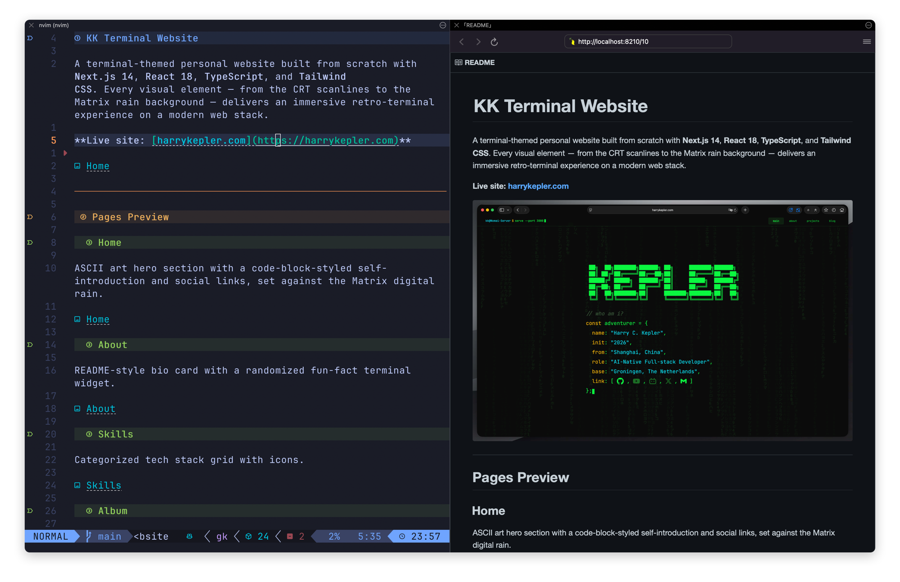

# iterm-preview.nvim

> Live Markdown preview that renders **inside your terminal** !


`:MarkdownPreview` is great, until it throws a browser window onto your desktop and your tidy
terminal workflow falls apart. This plugin hijacks the preview hand-off from
[`iamcco/markdown-preview.nvim`](https://github.com/iamcco/markdown-preview.nvim) and routes it into a
right-hand **iTerm2 browser pane** instead. Same live reload, same renderer, but minus the window juggling.

<p align="center">
  <br>
  <sub>Neovim on the left, the live preview in an iTerm2 browser split on the right.</sub>
</p>

---

## Why you'll like it

- 🪟 **No more stray browser windows.** The preview is a pane, not an app you have to alt-tab to.
- 🎯 **Focus stays in Neovim.** The split opens, then hands the keyboard right back to your editor.
- 🧲 **It travels with your terminal.** Move iTerm across Spaces, go full-screen, tile it, and the preview
  comes along, because it *is* iTerm.
- 🧹 **It cleans up after itself.** `:ItermMdPreviewStop`, or just closing the markdown buffer,
  closes the pane *and* stops the preview server. No orphaned tabs, no zombie node processes.

---

## Requirements

| | |
|---|---|
| OS | macOS 13+ |
| iTerm2 | **3.5.0+** 
| Neovim | 0.10+ 
| Dependency | [`iamcco/markdown-preview.nvim`](https://github.com/iamcco/markdown-preview.nvim) |
 

---

## Install

### lazy.nvim

```lua
{
  "Kepler2024/iTerm-preview.nvim",
  dependencies = {
    { "iamcco/markdown-preview.nvim", build = "cd app && npm install" },
  },
  ft = "markdown",
  opts = {}, -- defaults work out of the box once the iTerm profile exists
}
```

### packer.nvim

```lua
use {
  "Kepler2024/iTerm-preview.nvim",
  requires = { { "iamcco/markdown-preview.nvim", run = "cd app && npm install" } },
  config = function() require("iterm-preview").setup() end,
}
```

### vim-plug

```vim
Plug 'iamcco/markdown-preview.nvim', { 'do': 'cd app && npm install' }
Plug 'Kepler2024/iTerm-preview.nvim'

" then, after plugins load:
lua require('iterm-preview').setup()
```

---

## One-time iTerm profile setup

The preview pane is just an iTerm **Browser-type** profile. You create it once:

1. **iTerm → Settings → Profiles → `+`** (create new profile).
2. Set **Profile Type → Browser**.
3. Name it **`Browser`** (default). 
4. Under **General → Custom URL**, paste `file:///tmp/iterm-preview.html`.
5. Run **`:checkhealth iterm-preview`** 

First `:ItermMdPreview` triggers a one-time macOS Automation prompt. Click **OK** to let your
terminal drive iTerm.

> Not sure you got step 4 right? `:checkhealth iterm-preview` prints the precise
> `file://…` string your profile should use. Copy it from there.

---

## Usage

```vim
:ItermMdPreview        " preview the current buffer in an iTerm split
:ItermMdPreviewStop    " close the pane and stop the server
```

Keymaps Config:
```lua
vim.keymap.set("n", "<leader>mp", "<cmd>ItermMdPreview<cr>",     { desc = "Markdown preview (iTerm)" })
vim.keymap.set("n", "<leader>ms", "<cmd>ItermMdPreviewStop<cr>", { desc = "Stop markdown preview" })
```

| Command | What it does |
|---|---|
| `:ItermMdPreview` | **Open** the preview in an iTerm split (the command to reach for) |
| `:ItermMdPreviewStop` | **Close** the split *and* stop the preview server |
| `:MarkdownPreview` | Alias: mkdp's own command, transparently rerouted into the split |
| `:MarkdownPreviewStop` | Alias: overridden so it closes the split *and* stops the server |
| `:checkhealth iterm-preview` | Diagnose platform, iTerm version, automation permission, profile wiring |

---

## Configuration

Everything below is the default; call `setup()` with only what you want to change.

```lua
require("iterm-preview").setup({
  port = "8089",                              -- mkdp HTTP server port
  split = {
    direction = "right",                      -- right | left | below | above
  },
  auto_close = true,                          -- close the pane when the previewed buffer is closed
  notify_level = vim.log.levels.INFO,
  iterm_app = "iTerm",                        -- AppleScript application name
  profile = "Browser",                        -- iTerm Browser-type profile name
  filetypes = { "markdown" },                 -- forwarded to g:mkdp_filetypes
  bridge_html = "/tmp/iterm-preview.html",  -- meta-refresh bridge; must match the profile's Custom URL
  custom_script = nil,                        -- function(url) -> AppleScript string (full escape hatch)
})
```

---

## Special thanks

With thanks to the projects this plugin plugs into:

- **[markdown-preview.nvim](https://github.com/iamcco/markdown-preview.nvim)** for the Markdown rendering and live reload.
- **[iTerm2](https://iterm2.com/)** (3.5+) for the Browser-type split the preview runs in.

## License

[MIT](./LICENSE).
